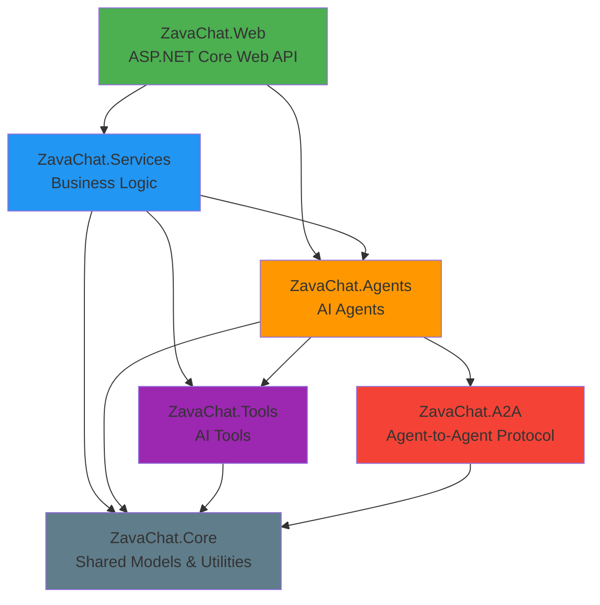
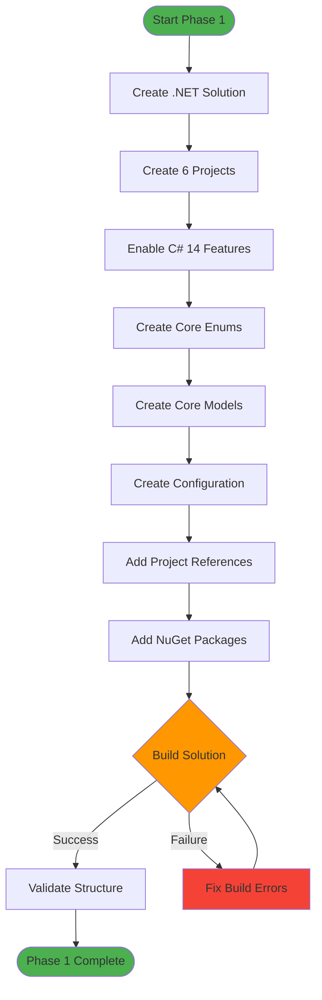

# Phase 1: Foundation - Implementation Guide

## 🎯 Phase Overview

**Goal**: Establish the foundational C# solution structure with core models, utilities, and project references.

**Duration**: Week 1-2  
**Status**: 🟢 In Progress

---

## 📋 Phase 1 Objectives

- ✅ Create .NET 10 solution with 6 projects
- ✅ Define core models and data structures
- ✅ Implement base utilities and extensions
- ✅ Set up project dependencies
- ✅ Configure C# 14 features (nullable reference types, file-scoped namespaces, etc.)
- ✅ Add essential NuGet packages
- ✅ Create configuration schemas
- ✅ Set up logging infrastructure
- ✅ Build and validate solution compiles

---

## 🏗️ Solution Architecture



---

## 📁 Project Structure

```
csharp-implementation/
├── ZavaChat.sln                          # Solution file
│
├── ZavaChat.Core/                        # Core models and utilities
│   ├── Models/
│   │   ├── ChatMessage.cs               # Chat message model
│   │   ├── Product.cs                   # Product model
│   │   ├── CartItem.cs                  # Shopping cart item
│   │   ├── AgentConfig.cs               # Agent configuration
│   │   └── AgentResponse.cs             # Agent response model
│   ├── Enums/
│   │   ├── MessageRole.cs               # User/Assistant/System
│   │   ├── AgentType.cs                 # Agent types enumeration
│   │   └── MediaType.cs                 # Image/Video/Text
│   ├── Interfaces/
│   │   ├── IAgent.cs                    # Base agent interface
│   │   ├── ITool.cs                     # Base tool interface
│   │   └── IAgentService.cs             # Agent service interface
│   ├── Extensions/
│   │   ├── StringExtensions.cs          # String utilities
│   │   ├── JsonExtensions.cs            # JSON helpers
│   │   └── HttpExtensions.cs            # HTTP utilities
│   └── Configuration/
│       ├── AzureAIConfig.cs             # Azure AI configuration
│       ├── StorageConfig.cs             # Storage configuration
│       └── LoggingConfig.cs             # Logging configuration
│
├── ZavaChat.Agents/                      # AI Agents
│   ├── Base/
│   │   ├── AgentBase.cs                 # Base agent implementation
│   │   └── AgentProcessor.cs            # Agent orchestration
│   ├── InteriorDesignerAgent.cs         # Interior design agent
│   ├── CustomerLoyaltyAgent.cs          # Loyalty/rewards agent
│   ├── InventoryAgent.cs                # Inventory management agent
│   └── CoraAgent.cs                     # General assistant agent
│
├── ZavaChat.Tools/                       # AI Tools
│   ├── Base/
│   │   └── ToolBase.cs                  # Base tool implementation
│   ├── SearchTools/
│   │   ├── ProductSearchTool.cs         # Product search
│   │   └── InventoryCheckTool.cs        # Inventory lookup
│   ├── MediaTools/
│   │   ├── ImageAnalysisTool.cs         # Image analysis
│   │   └── VideoAnalysisTool.cs         # Video analysis
│   └── UtilityTools/
│       ├── WebSearchTool.cs             # Web search
│       └── CalculatorTool.cs            # Calculations
│
├── ZavaChat.Services/                    # Business logic
│   ├── AgentOrchestrationService.cs     # Agent coordination
│   ├── HandoffService.cs                # Agent handoff logic
│   ├── FallbackService.cs               # Error handling
│   └── StateManagementService.cs        # Session state
│
├── ZavaChat.A2A/                         # Agent-to-Agent
│   ├── Models/
│   │   ├── A2AMessage.cs                # A2A message format
│   │   └── A2AProtocol.cs               # Protocol definition
│   ├── A2AServer.cs                     # A2A server
│   └── A2AClient.cs                     # A2A client
│
└── ZavaChat.Web/                         # Web application
    ├── Program.cs                        # Application entry point
    ├── Hubs/
    │   └── ChatHub.cs                    # SignalR hub
    ├── Controllers/
    │   ├── ChatController.cs             # Chat API endpoints
    │   └── HealthController.cs           # Health check
    ├── Middleware/
    │   └── ErrorHandlingMiddleware.cs    # Global error handling
    └── appsettings.json                  # Configuration
```

---

## 🔧 Implementation Steps

### Step 1: Core Models (ZavaChat.Core)

#### 1.1 Create Enums

**File**: `ZavaChat.Core/Enums/MessageRole.cs`

```csharp
namespace ZavaChat.Core.Enums;

/// <summary>
/// Represents the role of a message sender in a chat conversation.
/// </summary>
public enum MessageRole
{
    /// <summary>User message</summary>
    User,
    
    /// <summary>Assistant/Agent message</summary>
    Assistant,
    
    /// <summary>System message</summary>
    System
}
```

**File**: `ZavaChat.Core/Enums/AgentType.cs`

```csharp
namespace ZavaChat.Core.Enums;

/// <summary>
/// Represents the type of AI agent.
/// </summary>
public enum AgentType
{
    /// <summary>General assistant agent (Cora)</summary>
    General,
    
    /// <summary>Interior designer agent</summary>
    InteriorDesigner,
    
    /// <summary>Customer loyalty agent</summary>
    CustomerLoyalty,
    
    /// <summary>Inventory management agent</summary>
    Inventory,
    
    /// <summary>No agent selected</summary>
    None
}
```

**File**: `ZavaChat.Core/Enums/MediaType.cs`

```csharp
namespace ZavaChat.Core.Enums;

/// <summary>
/// Represents the type of media content.
/// </summary>
public enum MediaType
{
    /// <summary>Text content</summary>
    Text,
    
    /// <summary>Image content</summary>
    Image,
    
    /// <summary>Video content</summary>
    Video,
    
    /// <summary>Audio content</summary>
    Audio
}
```

#### 1.2 Create Core Models

**File**: `ZavaChat.Core/Models/ChatMessage.cs`

```csharp
namespace ZavaChat.Core.Models;

using ZavaChat.Core.Enums;

/// <summary>
/// Represents a message in the chat conversation.
/// </summary>
public sealed record ChatMessage
{
    /// <summary>Unique message identifier</summary>
    public string Id { get; init; } = Guid.NewGuid().ToString();
    
    /// <summary>Role of the message sender</summary>
    public required MessageRole Role { get; init; }
    
    /// <summary>Message content</summary>
    public required string Content { get; init; }
    
    /// <summary>Agent type that generated this message</summary>
    public AgentType? AgentType { get; init; }
    
    /// <summary>Timestamp when message was created</summary>
    public DateTime Timestamp { get; init; } = DateTime.UtcNow;
    
    /// <summary>Indicates if this is an error message</summary>
    public bool IsError { get; init; }
    
    /// <summary>Media URL if message contains media</summary>
    public string? MediaUrl { get; init; }
    
    /// <summary>Type of media if present</summary>
    public MediaType MediaType { get; init; } = MediaType.Text;
    
    /// <summary>Additional metadata</summary>
    public Dictionary<string, object>? Metadata { get; init; }
}
```

**File**: `ZavaChat.Core/Models/Product.cs`

```csharp
namespace ZavaChat.Core.Models;

/// <summary>
/// Represents a product in the catalog.
/// </summary>
public sealed record Product
{
    /// <summary>Unique product identifier</summary>
    public required string Id { get; init; }
    
    /// <summary>Product name</summary>
    public required string Name { get; init; }
    
    /// <summary>Product description</summary>
    public required string Description { get; init; }
    
    /// <summary>Product price</summary>
    public required decimal Price { get; init; }
    
    /// <summary>Product image URL</summary>
    public required string ImageUrl { get; init; }
    
    /// <summary>Product category</summary>
    public required string Category { get; init; }
    
    /// <summary>Available quantity</summary>
    public int Quantity { get; init; }
    
    /// <summary>Product SKU</summary>
    public string? Sku { get; init; }
    
    /// <summary>Product tags for search</summary>
    public List<string>? Tags { get; init; }
}
```

**File**: `ZavaChat.Core/Models/CartItem.cs`

```csharp
namespace ZavaChat.Core.Models;

/// <summary>
/// Represents an item in the shopping cart.
/// </summary>
public sealed record CartItem
{
    /// <summary>Product reference</summary>
    public required Product Product { get; init; }
    
    /// <summary>Quantity of this product in cart</summary>
    public required int Quantity { get; init; }
    
    /// <summary>When item was added to cart</summary>
    public DateTime AddedAt { get; init; } = DateTime.UtcNow;
    
    /// <summary>Calculated line total (Price * Quantity)</summary>
    public decimal LineTotal => Product.Price * Quantity;
}
```

#### 1.3 Create Configuration Models

**File**: `ZavaChat.Core/Configuration/AzureAIConfig.cs`

```csharp
namespace ZavaChat.Core.Configuration;

/// <summary>
/// Configuration for Azure AI services.
/// </summary>
public sealed record AzureAIConfig
{
    /// <summary>Configuration section name</summary>
    public const string SectionName = "AzureAI";
    
    /// <summary>Azure AI endpoint</summary>
    public required string Endpoint { get; init; }
    
    /// <summary>Azure AI API key</summary>
    public required string ApiKey { get; init; }
    
    /// <summary>Deployment name</summary>
    public required string DeploymentName { get; init; }
    
    /// <summary>Model name</summary>
    public string ModelName { get; init; } = "gpt-4";
    
    /// <summary>Maximum tokens for responses</summary>
    public int MaxTokens { get; init; } = 4096;
    
    /// <summary>Temperature setting</summary>
    public double Temperature { get; init; } = 0.7;
}
```

### Step 2: Project Dependencies

#### 2.1 Add Project References

```bash
# ZavaChat.Agents depends on Core
cd ZavaChat.Agents && dotnet add reference ../ZavaChat.Core/ZavaChat.Core.csproj

# ZavaChat.Tools depends on Core
cd ../ZavaChat.Tools && dotnet add reference ../ZavaChat.Core/ZavaChat.Core.csproj

# ZavaChat.Services depends on Core, Agents, Tools
cd ../ZavaChat.Services && dotnet add reference ../ZavaChat.Core/ZavaChat.Core.csproj
cd ../ZavaChat.Services && dotnet add reference ../ZavaChat.Agents/ZavaChat.Agents.csproj
cd ../ZavaChat.Services && dotnet add reference ../ZavaChat.Tools/ZavaChat.Tools.csproj

# ZavaChat.A2A depends on Core
cd ../ZavaChat.A2A && dotnet add reference ../ZavaChat.Core/ZavaChat.Core.csproj

# ZavaChat.Web depends on all
cd ../ZavaChat.Web && dotnet add reference ../ZavaChat.Core/ZavaChat.Core.csproj
cd ../ZavaChat.Web && dotnet add reference ../ZavaChat.Agents/ZavaChat.Agents.csproj
cd ../ZavaChat.Web && dotnet add reference ../ZavaChat.Tools/ZavaChat.Tools.csproj
cd ../ZavaChat.Web && dotnet add reference ../ZavaChat.Services/ZavaChat.Services.csproj
cd ../ZavaChat.Web && dotnet add reference ../ZavaChat.A2A/ZavaChat.A2A.csproj
```

#### 2.2 Add Essential NuGet Packages

**ZavaChat.Core**:
```bash
dotnet add package Microsoft.Extensions.Configuration.Abstractions
dotnet add package Microsoft.Extensions.Logging.Abstractions
dotnet add package System.Text.Json
```

**ZavaChat.Web**:
```bash
dotnet add package Microsoft.AspNetCore.SignalR
dotnet add package Azure.AI.OpenAI
dotnet add package Azure.Identity
dotnet add package Serilog.AspNetCore
dotnet add package OpenTelemetry.Extensions.Hosting
dotnet add package OpenTelemetry.Instrumentation.AspNetCore
```

### Step 3: Enable C# 14 Features

Update all `.csproj` files to enable latest features:

```xml
<PropertyGroup>
  <TargetFramework>net10.0</TargetFramework>
  <LangVersion>14</LangVersion>
  <Nullable>enable</Nullable>
  <ImplicitUsings>enable</ImplicitUsings>
  <TreatWarningsAsErrors>true</TreatWarningsAsErrors>
</PropertyGroup>
```

---

## ✅ Validation Checklist

- [ ] Solution builds without errors
- [ ] All projects reference correct dependencies
- [ ] C# 14 features enabled (nullable reference types)
- [ ] Core models created and compile
- [ ] Configuration models defined
- [ ] NuGet packages restored
- [ ] Unit test project setup (optional for Phase 1)

---

## 🧪 Build and Test

```bash
# Build entire solution
dotnet build

# Run tests (when added)
dotnet test

# Check for warnings
dotnet build --no-incremental --nologo -v q
```

---

## 📊 Phase 1 Completion Flowchart



---

## 🚀 Next Steps

After Phase 1 completion:
- **Phase 2**: Implement tools and services
- **Phase 3**: Implement AI agents
- **Phase 4**: Add SignalR hub and Web API
- **Phase 5**: Integrate Microsoft Agent Framework

---

## 📝 Notes

- Using C# 14 features: file-scoped namespaces, required members, record types
- All projects target .NET 10.0
- Nullable reference types enabled for better null safety
- Following clean architecture principles
- Separation of concerns maintained across projects

---

**Phase 1 Status**: 🟢 **In Progress**  
**Last Updated**: 2025-11-21
